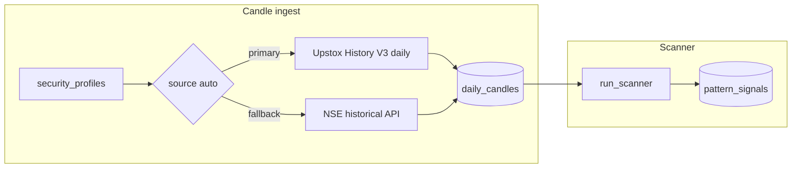

# Momentum Pattern Scanner

Research-only daily-bar pattern scanner for NSE mainboard stocks. Detects macro chart structures and micro triggers from local SQLite OHLCV data.

**Not investment advice.** Past pattern frequency does not guarantee future moves.

## End-to-end workflow

The scanner only reads **local** `daily_candles`. It never calls Upstox or NSE at scan time. Fresh results depend on candle ingest finishing first.

```text
1. timeline:sync-profiles   → security_profiles (~2,400 tickers)
2. timeline:upto-date       → daily_candles (incremental OHLCV)
3. scanner:run              → pattern_signals + scanner_runs
4. /scanner UI              → filter, chart, fundamentals panel
```

**Typical daily routine (after market open or at EOD):**

1. Run **Up-to-date** on Timeline Movers (`POST /api/timeline/ingest` with `since_last: true`) or `npm run timeline:upto-date`.
2. Confirm `GET /api/timeline/stats` shows `max_trade_date` = today (or latest session).
3. Run the scanner for that date (`POST /api/scanner/run` or `npm run scanner:run`).
4. Load results in `/scanner` — pick the scan date, apply filters, click rows for chart + fundamentals.

If you scan before today's bars are ingested, symbols are still processed but **skipped silently** when their last stored bar is not the scan date (see [Scan eligibility](#scan-eligibility)).

## Data layer

All persistent data lives in `data/trading.db` (SQLite WAL).

### Tables used by the scanner

| Table | Role in scan |
|-------|----------------|
| `security_profiles` | Ticker, sector, industry, instrument token |
| `daily_candles` | OHLCV + `daily_return_pct` + `source` (`upstox` / `nse`) |
| `scanner_runs` | One row per batch run (date, counts, status) |
| `pattern_signals` | Persisted hits (pattern, score, macro gate, details JSON) |

### Tables available but **not** used by `run_scanner`

| Table | Source | Purpose today |
|-------|--------|----------------|
| `company_fundamentals` | Upstox Fundamentals API | UI panel on row click; bulk via `fundamentals:sync-all` |
| `institutional_flows` | Upstox Market API (FII/DII) | `/market-info` page; `market-info:sync` |
| `derivative_snapshots` | Upstox + NSE option chain | OI, change OI, PCR, max pain for F&O watchlist |

### Data sources (candle ingest)



| Source | API | Notes |
|--------|-----|-------|
| **Upstox** (primary) | `GET /v3/historical-candle/{key}/days/1/{to}/{from}` | Requires `UPSTOX_ACCESS_TOKEN`. Best coverage for liquid names. |
| **NSE** (fallback) | `historical/cm/equity` | Used when Upstox errors (invalid instrument key, rate limit). Session-sensitive; can return HTML under load. |

**Up-to-date ingest** (`since_last: true`): for each symbol, fetches from `last_stored_date + 1` through `date.today()`. Symbols already at `max_trade_date` are **skipped**. Ingest status distinguishes:

- **new bars** — rows written
- **no new data** — API OK but 0 bars (often means historical daily has not published today's EOD yet)
- **failed** — retries exhausted

**Today's bar during market hours:** Upstox **historical daily** often lags for the current session (returns 0 candles for today until EOD is published). Upstox **intraday** (`/v3/historical-candle/intraday/.../days/1`) can return a live session OHLCV bar. The ingest pipeline currently uses historical daily only; if Up-to-date shows many **no new data** rows while the market is open, re-run after the session or wire intraday backfill (planned).

**Invalid instrument keys:** Some profiles have tokens Upstox rejects (`UDAPI100011 Invalid Instrument key`). Those symbols fall back to NSE; if NSE also fails, the symbol stays stale. Re-sync profiles or fix mapping — not a scanner bug.

### Coverage snapshot

Check anytime:

```bash
curl -s http://localhost:8000/api/timeline/stats | jq
```

Typical fields: `profile_count`, `symbols_with_data`, `max_trade_date`, `candle_count`, `institutional_flow_count`, `derivative_snapshot_count`.

Scanner date picker also exposes `latest_data_date` via `GET /api/scanner/dates`.

## Scan eligibility

Implemented in `backend/app/services/scanner/engine.py`:

| Rule | Value | Effect if unmet |
|------|-------|-----------------|
| Minimum history | **250** daily bars | Symbol skipped |
| Window loaded | **280** most recent bars | Used for SMA / 52w calculations |
| Bar on scan date | Last row `date` must equal `trade_date` | Symbol skipped (no partial-day scan) |
| Default scan date | `max_trade_date` from DB if omitted | Aligns with latest ingested session |

Eligible universe: `list_scan_eligible_tickers(min_bars=250)` — symbols with enough history **on or before** the scan date. A symbol can be eligible in SQL but still skipped if it has no candle row for that exact date.

**Implication:** After Up-to-date, if only 500/2400 symbols got today's bar, the scanner runs over ~2400 names but only ~500 contribute alerts for today; the rest increment `symbols_scanned` without signals.

## Strategies

| ID | Name | Type | Implemented |
|----|------|------|-------------|
| `vcp` | Volatility Contraction Pattern | Macro structure | Scored contractions + volume dry-up |
| `high_tight_flag` | High Tight Flag | Macro structure | Flagpole + tight flag consolidation |
| `pocket_pivot` | Pocket Pivot | Micro trigger | Up-day volume vs prior down-days |
| `inside_bar_cluster` | Inside Bar Cluster | Micro setup/trigger | Mother bar + 2–3 inside bars |
| `power_gap` | Power Gap | Micro trigger | Gap-up + volume (not earnings-confirmed) |

### Power Gap vs PEG

True **Power Earnings Gap (PEG)** requires an earnings calendar. Phase 1 implements **Power Gap** with the same price/volume rules but `peg_confirmed: false` in signal details.

## Naive vs implemented detection

### VCP

- **Naive:** Three overlapping rolling ranges compared once.
- **Implemented:** Sequential contraction depths over 20/10/5 session windows, volume trend decreasing, proximity to 52-week high. Score 0–100.

### High Tight Flag

- **Naive:** 15d min for flagpole, 4d flag only.
- **Implemented:** Flagpole 30–100% in 8–20 sessions; flag 3–10 sessions, ≤10% depth, closes in upper 50%, volume contraction.

### Pocket Pivot

- **Naive:** Any up-day vs max down-volume.
- **Implemented:** Requires base context (within 15% of 52w high), up-day definition includes close ≥ open, volume > max down-volume of prior 10 sessions.

### Inside Bar Cluster

- **Naive:** Two nested inside bars + one-day volume drop.
- **Implemented:** Mother bar (range > 1.5× ATR10), 2–3 consecutive inside bars, cluster volume < mother volume. `setup_ready` vs `triggered_today` on breakout.

### Power Gap

- **Naive:** 3% gap, 3× volume, strong close.
- **Implemented:** Gap ≥ 3% above prior high, volume ≥ 2.5× 20d avg, close in top 15% of range, not extended > 25% above SMA50.

## Trend template (macro gate)

Minervini-style filter applied before pattern scoring contributes to alerts:

- Price > SMA50 > SMA150 > SMA200
- SMA200 rising vs 20 sessions ago
- Price ≥ 30% above 52-week low
- Price within 25% of 52-week high
- Minimum 250 daily bars

Symbols failing the gate may still appear with `macro_pass: false` when micro triggers fire. UI filter **Macro pass only** maps to `macro_pass_only` on results API.

## Trigger quality gates (fakeout filters)

Applied in `backend/app/services/scanner/quality.py` after pattern detection (hard reject). Calibrated from historical forward returns on `pattern_signals`:

| Gate | Rule | Why |
|------|------|-----|
| Weak trigger close | Triggered alerts need `close_position ≥ 0.65` | Dominant fakeout tell |
| Climactic volume | `volume_z ≥ 3.5` requires `close_position ≥ 0.75` | Exhaustion spikes without conviction closes |
| Upper wick | `upper_wick ≥ 0.45` with close `< 0.70` | Intraday rejection / shooting-star style |
| VCP depth | Hard reject `base_depth_pct > 25%` (preferred ≤ 20%) | Deep bases showed ~28% 5d win rate |
| **20d run-up cap** | Triggered: reject `pre_20d > 18%` unless higher-low base and `≤ 25%` | July study: 20–25% bucket collapsed (T+10 WR ~33%) |

Configurable in `data/scanner_score_weights.json` under `quality.max_20d_runup_pct`. Engine tag: `darvas_v1` (sky calendar = rescanned with Darvas Setup).

## Fundamentals and scan quality

**Does the scanner need fundamentals to run?** No — pattern detection is price/volume only. Cached fundamentals adjust the **final score** and power the **Fund pass** filter.

| Layer | Source | Effect |
|-------|--------|--------|
| Pattern score | OHLCV rules | Base score in `details.pattern_score` |
| Fundamental gate | `company_fundamentals` → ROE, ROCE | +3 when pass; `details.fundamental.pass` |
| Market context | `derivative_snapshots`, `institutional_flows` | ±1–3 via NIFTY PCR, stock PCR, FII cash net |
| F&O overlay | `derivative_snapshots` (option OI + PCR) | Multiplier on composite; hard-reject short build-up; **FO** gate pill in UI |

**Full F&O gate definitions (FO n/a, sync, quadrants):** [scanner_patterns_and_status.md](./scanner_patterns_and_status.md#fo-overlay-futures--options).

Default thresholds in `backend/app/services/scanner/context.py`: **ROE ≥ 15%**, **ROCE ≥ 12%**. If ratios are missing, `fundamental.pass` is `null` (signal kept; excluded from **Fund pass** only).

Fundamentals are fetched per ticker (or bulk CLI) into `company_fundamentals`:

| Section | Upstox endpoint area | Scan use |
|---------|---------------------|----------|
| Key ratios (ROE, ROCE, …) | Fundamentals API | Gate + bonus |
| Company profile, financials, actions, peers | Fundamentals API | UI panel only |

Bulk sync skips tickers already cached unless listed in `data/fundamentals_sync_errors.log` (auto-retry queue).

## Market information

Stored for `/market-info` and **used in scan scoring** when synced:

| Data | Storage | Scan use |
|------|---------|----------|
| FII cash net | `institutional_flows` | ±2 pts (`market-info:sync --flows-only`) |
| NIFTY / stock PCR | `derivative_snapshots` | Index ±2–3 pts; F&O underlyings ±1 pt |
| OI / max pain | `derivative_snapshots` | F&O overlay quadrants + FO gate pill; max pain in UI |

```bash
npm run market-info:sync
npm run market-info:sync -- --flows-only
npm run market-info:sync -- --derivatives-only --date 2026-06-24
npm run market-info:sync -- --derivatives-only --date 2026-06-24 --all-fno
```

FII/DII rows may be empty until flows sync succeeds — PCR adjustments work from derivative snapshots alone. Without `--all-fno`, only indices + top default stocks are synced; most ★ scanner alerts will show **FO n/a** until you backfill (see [F&O overlay](./scanner_patterns_and_status.md#fo-overlay-futures--options)).

## Data gaps and accuracy limits

| Data | Impact on scanner | Workaround / status |
|------|-------------------|---------------------|
| Earnings calendar | Cannot label true PEG | `power_gap` only; `peg_confirmed: false` |
| Split-adjusted OHLC | False HTF/VCP after splits | Corporate actions in UI flag events; bars unadjusted |
| Relative Strength vs Nifty | Incomplete Minervini template | SMA stack only in Phase 1 |
| Intraday bars | No minute-level triggers | Daily bars only; intraday not aggregated into `daily_candles` yet |
| Delivery volume | Weaker institutional confirmation | Raw volume + z-score in patterns |
| Float / market cap | No low-float filter | Key ratios in UI; not in scan SQL |
| Stale / missing symbols | Skipped or under-represented on scan date | Up-to-date ingest; check `failed` + error patterns |
| Today's EOD on historical API | Gap until post-close or intraday backfill | Re-run Up-to-date; see [Data sources](#data-sources-candle-ingest) |

## Scoring thresholds (defaults)

| Pattern | Min score to persist |
|---------|---------------------|
| VCP | 55 |
| High Tight Flag | 60 |
| Pocket Pivot | 50 |
| Inside Bar Cluster | 50 |
| Power Gap | 55 |

Tune via constants in `backend/app/services/scanner/patterns.py`.

## UI (`/scanner`)

- **Run scan** — background job; poll `GET /api/scanner/status`
- **Scan date** — completed runs from `GET /api/scanner/dates`; defaults toward latest DB date
- **Result filters** (apply on Load): pattern, sector, min score, triggered only, setup only, macro pass, **fund pass**
- **Gate pills** — **Macro**, **Fund**, and **FO** (F&O rows only): pass / fail / warn / neutral / n/a
- **★ star** — F&O-listed ticker (from `GET /api/fno`); independent of whether derivative data is synced
- **VCP overlay** — optional chart bands for VCP patterns (toggle above chart)
- **Export JSON** — flattened rows with human-readable `why` field (`frontend/src/lib/scannerExport.ts`)
- **Fundamentals panel** — toggle sidebar; same Upstox cache as Timeline Movers
- **Chart** — daily OHLC for selected ticker

Result rows include same-day OHLCV on the signal for quick verification against the triggering bar.

## API

### Scanner

| Method | Path | Description |
|--------|------|-------------|
| `GET` | `/api/scanner/dates` | Past scan dates + `latest_data_date` |
| `GET` | `/api/scanner/patterns` | Pattern metadata |
| `POST` | `/api/scanner/run` | Start scan (`trade_date` optional) |
| `GET` | `/api/scanner/status` | Progress + `last_result` |
| `GET` | `/api/scanner/results` | Filtered alerts (`macro_pass_only`, `fundamental_pass_only`, …); FO overlay refreshed from DB on read |
| `GET` | `/api/scanner/results/{ticker}` | All patterns for one symbol on a date |
| `POST` | `/api/scanner/ensure-derivatives` | Fetch missing Upstox snapshots for F&O tickers on a date (`trade_date`, `tickers[]`) |
| `GET` | `/api/fno` | NSE F&O symbol list (★ star in UI) |

### Timeline (data prep)

| Method | Path | Description |
|--------|------|-------------|
| `GET` | `/api/timeline/stats` | DB coverage + date range |
| `POST` | `/api/timeline/ingest` | Bulk ingest / Up-to-date (`since_last`, `refresh_all`, …) |
| `GET` | `/api/timeline/ingest/status` | `success`, `empty`, `failed`, `total_bars`, cancel state |
| `POST` | `/api/timeline/ingest/cancel` | Stop running ingest |

## CLI

```bash
# Profiles + candles
npm run timeline:sync-profiles
npm run timeline:ingest          # bootstrap missing history
npm run timeline:upto-date         # incremental daily update (same as timeline:daily)

# Scanner
npm run scanner:run
npm run scanner:run -- --date 2026-06-24

# One-month backtest export (min score 80, forward returns) → data/scanner_analysis/
npm run scanner:analysis
```

See [scanner_analysis.md](./scanner_analysis.md) for field definitions and refinement workflow.

```bash
# Fundamentals (bulk)
npm run fundamentals:sync-all
npm run fundamentals:sync-all -- --force
npm run fundamentals:sync-all -- --limit 50 --delay 2 --section-delay 0.5

# Market info (FII/DII + derivatives)
npm run market-info:sync
npm run market-info:sync -- --date 2026-06-24 --derivatives-only
npm run market-info:sync -- --date 2026-06-24 --derivatives-only --all-fno
```

Up-to-date ingest: ~0.35s delay/symbol → ~15 min for full universe. Fundamentals: ~8 Upstox calls/ticker with backoff on 429.

## Example signal JSON

```json
{
  "ticker": "RELIANCE",
  "trade_date": "2026-06-24",
  "pattern_type": "pocket_pivot",
  "macro_pass": true,
  "score": 75.5,
  "triggered_today": true,
  "setup_ready": false,
  "open": 1305.7,
  "high": 1322.0,
  "low": 1297.5,
  "close": 1313.6,
  "volume": 11030917,
  "details": {
    "pattern_score": 72.5,
    "volume_ratio": 1.8,
    "in_base": true,
    "close_position": 0.82,
    "trend": {},
    "fundamental": {
      "available": true,
      "pass": false,
      "roe": 10.94,
      "roce": 10.58,
      "thresholds": { "roe_min": 15, "roce_min": 12 }
    },
    "market": {
      "available": true,
      "nifty_pcr": 1.19,
      "stock_pcr": 0.51,
      "score_delta": 1.0
    }
  }
}
```

Export JSON adds `pattern` (label), `status` (`trigger` | `setup` | `structure`), and `why` (narrative string). **Full definitions:** [scanner_patterns_and_status.md](./scanner_patterns_and_status.md).

## Troubleshooting

| Symptom | Likely cause | Action |
|---------|--------------|--------|
| Up-to-date: many **skipped**, 0 bars | DB already at `max_trade_date` | Normal if re-run same day without new EOD data |
| Up-to-date: many **no new data** | Historical daily missing today | Re-run after close; intraday backfill not wired yet |
| Up-to-date: **failed** on many symbols | Invalid Upstox keys or NSE HTML/rate limit | Check logs; `--source upstox` to isolate; fix profiles |
| Scan completes, 0 alerts, low scanned count | Scan date ≠ latest candle date | Match scan date to `max_trade_date`; run Up-to-date first |
| Scan runs but favourite ticker missing | < 250 bars or no bar on scan date | Ingest more history for that symbol |
| Fundamentals empty on click | Not synced yet | **Sync** in panel or `fundamentals:sync-all` |
| **FO n/a** on ★ F&O alerts | No `derivative_snapshots` for scan date | `market-info:sync --derivatives-only --date … --all-fno`; reload results. See [F&O overlay](./scanner_patterns_and_status.md#fo-overlay-futures--options) |
| F&O fetch banner error | Missing/expired `UPSTOX_ACCESS_TOKEN` | Update `.env`; restart backend |
| `409 Scanner already running` | Parallel run | Wait or restart backend |

## Changelog

### Phase 1 (MVP)

- Daily-only scanner, full universe (~2,400 stocks)
- Batch job + persisted results
- `/scanner` UI page

### Phase 1.25 (fundamentals UI)

- Upstox fundamentals on stock click (profile, financials, actions, peers)
- SQLite cache + manual **Sync**; not connected to scan engine
- CLI bulk ingest: `npm run fundamentals:sync-all`

### Phase 1.3 (data pipeline + market info)

- Documented ingest sources, Up-to-date semantics, scan eligibility rules
- Timeline ingest status: `empty` vs `success`, cancel endpoint
- Market Information module: FII/DII + derivative snapshots (`market-info:sync`, `/market-info` UI)
- Scanner export JSON with `why` narratives; fundamentals sidebar toggle

### Phase 1.5 (fundamentals + market in scan)

- ROE/ROCE fundamental gate (`details.fundamental`, +3 score bonus, **Fund pass** filter)
- Market score overlay: NIFTY PCR, stock PCR, FII cash net (`details.market`)
- `backend/app/services/scanner/context.py`

### Phase 1.6 (planned)

- Intraday → daily backfill for same-day bars before EOD historical publish
- Nifty RS line in trend template
- Chart pattern overlays on scanner chart
- Optional liquidity filter

### Phase 2 (planned)

- Earnings calendar → true PEG
- Corporate action adjustments to OHLC (not just UI flags)
- Intraday confirmation layer for triggers
- Walk-forward hit-rate panel
- DII / multi-segment FII weighting in macro score

### Phase 1.7 — OI Support Momentum (2026-06-30)

- Live `/oi-momentum` page: rolling 3–5m ATM support-zone put/call OI momentum
- Uses Upstox `get_put_call_option_chain` + in-memory snapshot deltas (not day-based `change_oi`)
- ATM hysteresis, multi-strike zone, volume confirmation gate
- Docs: [oi_momentum_scanner.md](./oi_momentum_scanner.md)
